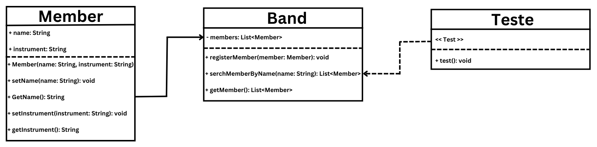

<!DOCTYPE html>
<html lang="pt-br">
<head>
    <meta charset="UTF-8">
    <meta name="viewport" content="width=device-width, initial-scale=1.0">
</head>
<body>

Sou estudante do 2º semestre de Banco de Dados na FATEC SJC e este repositório armazena atividades propostas pelo professor na disciplina de Engenharia de Software.

# Atividade 1 - 08-08-2024
    
Criar repositório no github chamado “bertoti”, dentro dele, criar uma pasta “Eng SW”, com arquivo README, colar esse trecho e comentar com as nossas palavras
    
>"We see three critical differences between programming and software engineering: time, scale, and the trade-offs at play. On a software engineering project, engineers need to be more concerned with the passage of time and the eventual need for change. In a software engineering organization, we need to be more concerned about scale and efficiency, both for the software we produce as well as for the organization that is producing it. Finally, as software engineers, we are asked to make more complex decisions with higher-stakes outcomes, often based on imprecise estimates of time and growth."
    
O texto define a principal diferença entre o programador e o engenheiro de software. Ambos têm, sim, muitas características em comum, porém, o engenheiro de software tem três características importantíssimas a mais: o tempo, a escala e os trade-offs. Essas três diferenças referem-se à estratégia que será utilizada para o desenvolvimento do software.
    
Enquanto o programador apenas programa o que lhe foi pedido, o engenheiro de software precisa ter noção do tempo em que o projeto está em andamento, verificando se o prazo é viável e se é necessário dedicar-se a certas funções, adaptando-se ao cronograma.
    
Outra característica citada foi a escala. Escala refere-se ao crescimento do software e à gestão do desenvolvimento de forma a possibilitar sua ampliação. Isso muitas vezes significa que o código deve ser criado de maneira mais complexa, mas permitindo que, no futuro, possa ser ampliado de forma simples.
    
A última característica mencionada é o trade-off. Em português, podemos traduzir como "jogo de perda e ganho". Refere-se às decisões que tomamos na hora de criar um código. Não existem formas ou linguagens melhores que as outras; todos os tipos têm suas vantagens e desvantagens. Cabe ao engenheiro de software observar e identificar quais formas e linguagens se adequam melhor para atingir o objetivo. Além das tecnologias, trade-offs também se refere ao gerenciamento da equipe, incluindo a decisão do melhor método de trabalho, treinamentos e prazos.

 
    
# Atividade 2 - 12-08-2024
    
Listar 3 trade-offs não funcionais
    
- **Desempenho:** Quando otimizamos o desempenho de um aplicativo, utilizamos técnicas complexas para reduzir o tempo de resposta. No entanto, isso pode dificultar a escalabilidade, pois quando optimizamos muito, podemos ter mais dificuldades em dividir ou replicar em múltiplas instâncias ou servidores quando a demanda aumenta oque prejudica a escalabilidade.
    
- **Segurança:** Um sistema altamente seguro exige processos mais complexos, como múltiplas senhas ou autenticação de dois fatores, o que pode frustrar os usuários e tornar o software menos acessível. Por outro lado, um sistema mais fácil de usar sacrifica camadas de segurança, tornando-o mais vulnerável a ataques.
    
- **Manutenibilidade:** Um código escrito de forma altamente otimizada para desempenho pode ser difícil de entender e manter. Já um código mais legível e organizado pode sacrificar o desempenho, mas facilitará a manutenção e a evolução do software no futuro.

 

# Atividade 3 - 16-08-2024 

- Repetir as classes SalaAula e Aula com um exemplo seu!(Java)
- Faça testes automatizados!

  O professor passou o exemplo de uma sala de aula. Eu vou utilizar o exemplo de uma banda ([Wings](https://open.spotify.com/intl-pt/artist/3sFhA6G1N0gG1pszb6kk1m?autoplay=true)).

### Criação da classe concert
  		
    	package Concert;

        /** Criada a classe BandMember aonde adicionei os atributos name que terá o nome do integrante da banda e 
        * o atributo instrument que é o instrumento que o integrante toca*/
        public class Member{
	
	    // Todos os atributos são texto
	    private String name;
	    private String instrument;
	
	    //Criação do construtor que quando chamado, colocará os valores nos atributos dos objetos de classe BandMember
	    public Member(String name, String instrument) {
		    this.name = name;
		    this.instrument = instrument;
	    }
	
	    //Criação de construtor que quando chamado, vincula o texto digitado ao atributo name
	    public void setName(String name) {
		    this.name = name;
	    }

	    //Criado o método que quando chamado, imprime o nome do integrante
		    public String getName() {
		    	return name;
	    	}
	
	    //Criação de construtor que quando chamado, vincula o texto digitado ao atributo instrument
	    public void setInstrument(String instrument) {
		    this.instrument = instrument;
	    }

    	//Criado o método que quando chamado, imprime o instrumento que o integrante da banda toca
    	public String getInstrument() {
		    return instrument;
	    }

	    }
     
 

### Criação da classe Band
	package Concert;

	//Importa as bibliotecas List e LinkedList
	import java.util.LinkedList;
	import java.util.List;

	// Criada a classe Band
	public class Band {
	
	// Criada uma lista com membros da banda e chamada de members
	private List<Member> members = new LinkedList<Member>();

	// Construtor que vai adicionar um objeto member na lista members
	public void registerMember(Member member) {
		members.add(member);
	}
	
	// Criado um método chamado serchMemberByName na lista Member que utilizaremos para localizar uma string 
	// no atributo name do objeto Member
	public List<Member> serchMemberByName(String name){
		// Criada o objeto membersFound e vinculada a lista Member a ele
		List<Member> membersFound = new LinkedList<Member>();
		//  Vai procurar o atributo member do objeto Member na lista members
		for(Member member:members) {
			//Se o metodo getName do objeto member for igual ao nome, ele vai adicionar esse nome a lista
			if(member.getName().equals(name)) 
				membersFound.add(member);
		}
		//retorna a lista mambersFound
		return membersFound;
	}
	
	// Criação do metodo getMember que vai retornar a lista members
	public List<Member> getMember() {
		return members;
	}
	
	}

 
 
### Teste automatizado
	package Concert;

	import static org.junit.jupiter.api.Assertions.*;
	import java.util.List;

	import org.junit.jupiter.api.Test;

	public class Teste {
	
	@Test
	void test() {
		
		Band Wings = new Band();
		
		Member Paul = new Member("Paul", "Bass");
		Member Linda = new Member("Linda", "Kayboard");
		Member Danny = new Member("Danny", "Guitar");
		
		Wings.registerMember(Paul);
		Wings.registerMember(Linda);
		Wings.registerMember(Danny);
		
		assertEquals(Wings.getMember().size(), 3);
		
		List<Member> Formation = Wings.serchMemberByName("Paul");
		assertEquals(Formation.get(0).getInstrument(), Paul.getInstrument());		
	}
	
	

	}

### Atividade  4 - 25/10/2024
- Diagrama de Classes UML   
Professor pediu para que fizessemos o diagrama das classes da atividade 3

 
### Atividade  5 - 22-11-2024
- Bot Telegram
  
Professor pediu para que fizessemos um chat bot no telegram com inteligência artificial Ollama. Trabalho feito em trio.
[Clique aqui para acessar bot](https://github.com/darloscaniel/bertoti/tree/main/Eng%20SW/ChatBot-Assist)

</body>
</html>
