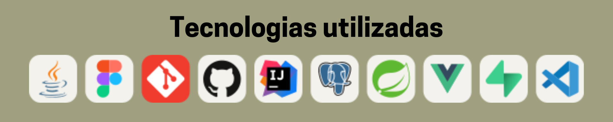
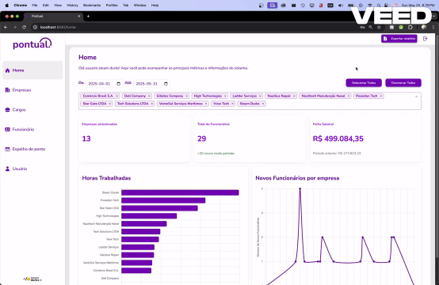
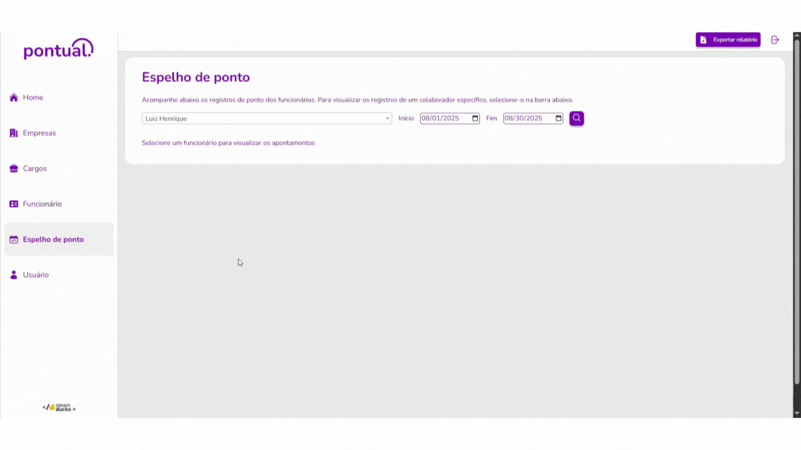
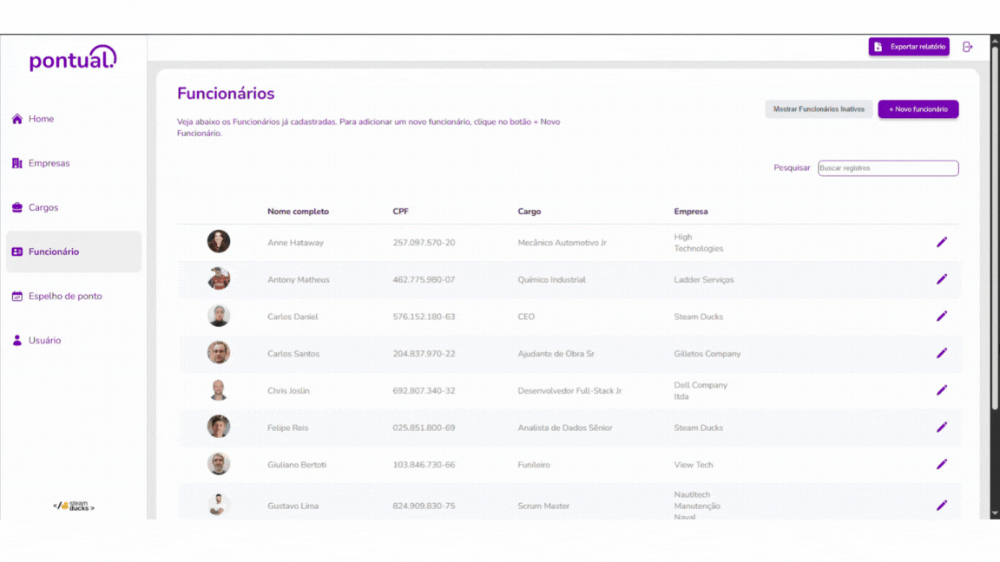
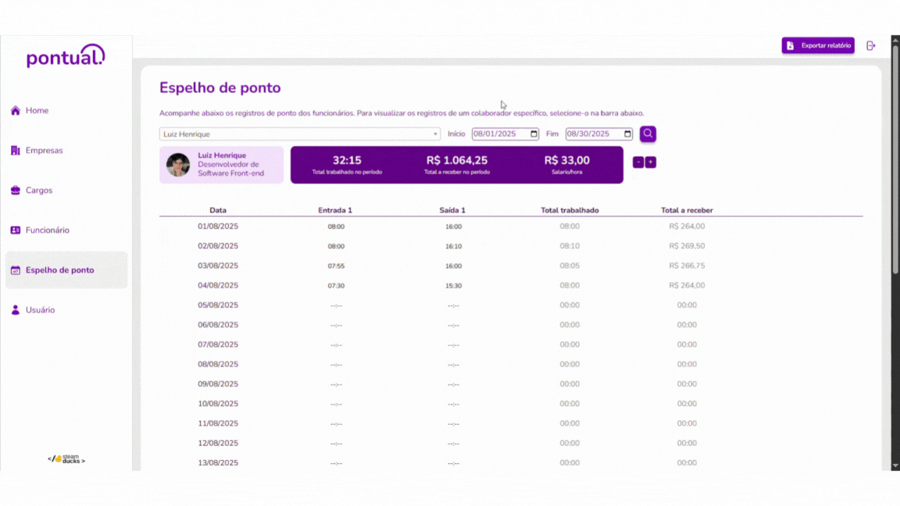

  <!-- Banner (opcional, mas adiciona um toque profissional) -->
  <!-- Substitua 'LINK_PARA_SEU_BANNER' pela URL da sua imagem de banner, se tiver uma. -->
  
   
   
  

  Olá! Meu nome é <b>Luiz</b> e atualmente curso o <b>4º semestre de Banco de Dados</b> na Fatec de São José dos Campos. Trabalho como desenvolvedor na empresa <b>Pandô</b>.
   

<!-- Links de Contato com Badges Estilizados -->
  

    
    
    
  

  

    
  

  

 <h1>3º Semestre • 1/2025</h1>

  <h3><a href="https://github.com/Steam-Ducks/point-system" target="_blank">Pontual - Sistema de Ponto</a></h3>
  
<i>Aplicação web para monitorar horas trabalhadas de funcionários de empresas terceirizadas, desenvolvida para a empresa Altave.</i>

   
  
   
  

    
  

  
Detalhes do Projeto

  <h2>Introdução</h2>
  

    No terceiro semestre, desenvolvemos um sistema de ponto que batisamos de Pontual, uma aplicação web para monitorar horas trabalhadas de funcionários de empresas terceirizadas. Nosso cliente, a Altave, é uma empresa que atua com coleta de imagens e reconhecimento facial, começaram com balões meteorológicos e hoje trabalham com segurança, por exemplo, em plataformas petrolíferas.
  

  

    O caso que o cliente nos apresentou envolvia um estaleiro, onde empresas terceiras fazem manutenção em navios. As câmeras da Altave identificam os colaboradores e enviam essas informações para o sistema, que registra os pontos, calcula horas trabalhadas e gera o valor do salário individualmente.
  

  

    No projeto, desenvolvemos uma interface para cadastro de empresas e profissionais, filtros de dados, extração de relatórios e dashboards interativos. Um dos desafios foi lidar com funcionários em escalas noturnas e permitir a edição de pontos.
  

  

    
  

  <h2>Contribuições Pessoais</h2>
  

    
🛠️ Estruturação do projeto em Vue.js

    
  

    - Organizei as pastas, defini rotas e criei padrões de código para garantir consistência no projeto.
    - Estruturei os layouts principais e componentes reutilizáveis.
  

  
<b>Trecho do arquivo de rotas:</b>

    
    <pre><code class="language-js">
    import UserPage from '@/views/users/UserIndex.vue';
    import Test from '@/components/Test.vue';
    import LoginPage from '@/views/auth/AuthIndex.vue';
    import admintLayout from "@/layout/AdmintLayout.vue";
    import PositionPage from '@/views/position/PositionIndex.vue';

    const routes = [
      {
        path: '/',
        name: 'Login',
        component: LoginPage,
      },
      {
        path: '/home',
        name: 'Home',
        meta: { requiresAuth: true },
        component: admintLayout,
        children: [
          {
            path: '',
            component: HomePage
          }
        ]
      },
      {
        path: '/user',
        component: AdminLayout,
        meta: { requiresAuth: true },
        children: [
          {
            path: '',
            component: UserPage,
          },
        ],
      }
      ...
    ];
  </code></pre>

  

      
<b>Navegação entre as páginas:</b>

      
  

  

  

  

    
⚙️ Integração do frontend com o backend

  

    - Implementei a comunicação com a API, consumindo endpoints para exibição e manipulação de dados.
    - Configurei interceptadores de requisição/resposta para lidar com autenticação e erros.
  

  
<b>Trecho do arquivo `TimeRecordService`:</b>

  <pre>
              
    <code class="language-js">
    import axios from 'axios';
    import UserService from './UserService';

    const API_URL = 'http://localhost:8080/api/timerecords';

    const formatToLocalDateTimeString = (dateInput) => {
      let date;

      if (dateInput instanceof Date) {
        date = dateInput;
      } else if (typeof dateInput === 'string') {
        if (/^\d{4}-\d{2}-\d{2}$/.test(dateInput)) {
          return `${dateInput}`;
        }
        date = new Date(dateInput);
      } else {
        console.warn("Tipo de data inválido recebido:", dateInput);
        return null;
      }

      if (!date || isNaN(date.getTime())) {
        console.warn("Não foi possível parsear a data:", dateInput);
        return null;
      }
    };
</code></pre>

  

      
<b>Consumo de end point para listar marcações de ponto:</b>

    
  

  

  

  

    
🖥️ Contribuições no backend

  
  

    - Criação de classes e services.
    - Integração com banco online <b>Supabase</b>.
  

  
<b>Trecho da classe `EmployeeController`:</b>

    
    <pre><code class="language-java">
    public class EmployeeController {
        @Autowired
        private final EmployeeService employeeService;
        private final SupabaseStorageService supabaseStorageService;

        public EmployeeController(EmployeeService employeeService, SupabaseStorageService supabaseStorageService) {
            this.employeeService = employeeService;
            this.supabaseStorageService = supabaseStorageService;
        }

        @PostMapping
        public ResponseEntity<?> createEmployee(@RequestBody EmployeeDto employeeDto) {
            try {
                int employeeId = employeeService.createEmployee(employeeDto);
                return ResponseEntity.status(HttpStatus.CREATED)
                        .body(Map.of("id", employeeId));
            } catch (IllegalArgumentException e) {
                return ResponseEntity.status(HttpStatus.BAD_REQUEST)
                        .body(Map.of("message", e.getMessage()));
            } catch (ResponseStatusException e) {
                return ResponseEntity.status(HttpStatus.NOT_FOUND)
                        .body(Map.of("message", e.getReason()));
            } catch (Exception e) {
                return ResponseEntity.status(HttpStatus.INTERNAL_SERVER_ERROR)
                        .body(Map.of("message", "Erro ao criar um novo funcionário. Tente novamente."));
            }
        }

        @PostMapping("/uploadPhoto")
        public ResponseEntity<?> uploadEmployeePhoto(@RequestParam("file") MultipartFile file) {
            try {
                String photoUrl = supabaseStorageService.uploadEmployeePhoto(file);
                return ResponseEntity.ok(Map.of("photoUrl", photoUrl));
            } catch (Exception e) {
                return ResponseEntity.status(HttpStatus.INTERNAL_SERVER_ERROR)
                        .body(Map.of("message", "Erro no upload de foto"));
            }
        }
    }
    
  </code></pre>
        
  
<b>Trecho do `application.properties`:</b>

    <pre><code class="language-properties">
    spring.jpa.database=postgresql
    spring.jpa.database-platform=org.hibernate.dialect.PostgreSQLDialect
    spring.jpa.hibernate.ddl-auto=none
    spring.jpa.show-sql=true

    supabase.auth.token=Bearer eyJhbGciOiJIUzI1NiIsInR5cCI6IkpXVCJ9...
    spring.datasource.url=jdbc:postgresql://aws-0-sa-east-1.pooler.supa...
    spring.datasource.username=postgres...
    spring.datasource.password=********
    spring.datasource.driver-class-name=org.postgresql.Driver
  </code></pre>
    

      
<b>Consumo de end point para listar marcações de ponto:</b>

      
    

  

  

        
🚀 Criação da folha de ponto

    
  

    - Criação da lógica por calculo e impressão dos pontos em telas
  

  
<b>Trecho de TimeReconrdIndex.vue</b>

    <pre><code class="language-js">
    computed: {
    // Lista os funcionarios no select
    employeeslist() {
      return this.employees.map((employee) => ({
        id: employee.id,
        name: employee.name,
      }));
    },
    hasAnyEntrada2() {
        return this.processedTimeRecords.some(record => record.entrada2);
    },
    hasAnyEntrada3() {
        return this.processedTimeRecords.some(record => record.entrada3);
    },

    totalWorkedPeriod() {
    if (!this.processedTimeRecords || this.processedTimeRecords.length === 0) {
      return '00:00';
    }

    const totalMinutes = this.processedTimeRecords.reduce((sum, record) => {
      const [hours, minutes] = record.totalTrabalhadoDia.split(':').map(Number);
      return sum + (hours * 60) + minutes;
    }, 0);

    const hours = Math.floor(totalMinutes / 60);
    const minutes = totalMinutes % 60;
    return `${String(hours).padStart(2, '0')}:${String(minutes).padStart(2, '0')}`;
    },
  </code></pre>

  

      
<b>Exemplo de inclusão de ponto:</b>

    
  

  
  ---
  
## Aprendizados

### 💻 Hard Skills

  
🛠️ Vue.js e arquitetura de frontend

  <ul>
    <li>Aprendi a organizar rotas, layouts e componentes reutilizáveis em um projeto de médio porte.</li>
    <li>Esse aprendizado veio da necessidade de manter a aplicação escalável, já que várias telas compartilhavam elementos comuns.</li>
    <li>Isso ajudou o time a padronizar o código e reduzir retrabalho no desenvolvimento do frontend.</li>
  </ul>

  
🛠️ Integração de frontend e backend

  <ul>
    <li>Desenvolvi a habilidade de consumir APIs reais e lidar com autenticação, erros e tratamento de dados.</li>
    <li>Essa experiência veio principalmente da criação dos serviços de comunicação com a API no Vue.js.</li>
    <li>No projeto, isso foi essencial para garantir que as telas exibissem informações atualizadas e funcionais para o cliente.</li>
  </ul>

  
🛠️ Java Spring Boot e integração com banco de dados

  <ul>
    <li>Ganhei prática com a criação de controllers, services e integração com o Supabase.</li>
    <li>Aprendi a lidar com persistência de dados em PostgreSQL e tratamento de exceções no backend.</li>
    <li>Esse aprendizado foi crucial para estruturar o backend de forma confiável e segura, suportando as regras de negócio.</li>
  </ul>

  
🛠️ SQL e consultas otimizadas

  <ul>
    <li>Melhorei minha escrita de queries no PostgreSQL, incluindo consultas com filtros de data e agregações.</li>
    <li>Esse conhecimento veio da necessidade de gerar relatórios de horas trabalhadas e cálculos de folha de ponto.</li>
    <li>Isso permitiu que o sistema apresentasse informações corretas e em tempo hábil para o cliente.</li>
  </ul>

### 🤝 Soft Skills

  
🌱 Colaboração em equipe

  <ul>
    <li>Auxiliei meus colegas de grupo no desenvolvimento de suas partes do projeto, oferecendo suporte técnico e sugestões.</li>
    <li>Essa colaboração ajudou o time a manter o ritmo de trabalho e reduzir retrabalho.</li>
    <li>Contribuiu para um ambiente mais coeso e eficiente durante todo o desenvolvimento.</li>
  </ul>

  
🌱 Brainstorm e planejamento

  <ul>
    <li>Participei de sessões de brainstorming para definir quais telas e funcionalidades o sistema precisaria ter.</li>
    <li>Ajudei a identificar soluções para fluxos complexos, como marcações de ponto que atravessam a meia-noite.</li>
    <li>Essas decisões antecipadas facilitaram o desenvolvimento e reduziram possíveis retrabalhos.</li>
  </ul>

  
🌱 Resolução de problemas complexos

  <ul>
    <li>Contribuí para encontrar soluções técnicas para situações desafiadoras, como horários noturnos e cálculos de ponto específicos.</li>
    <li>Isso exigiu análise lógica e criatividade, garantindo que a aplicação funcionasse corretamente em todos os cenários.</li>
    <li>Minimizou erros e melhorou a confiabilidade do sistema.</li>
  </ul>

  
🌱 Organização e revisão de tarefas

  <ul>
    <li>Auxiliei na revisão e organização do código de colegas, mantendo padrões consistentes.</li>
    <li>Isso ajudou a evitar conflitos e problemas de integração entre diferentes partes do sistema.</li>
    <li>Contribuiu para a qualidade geral do projeto e facilitou o desenvolvimento colaborativo.</li>
  </ul>

