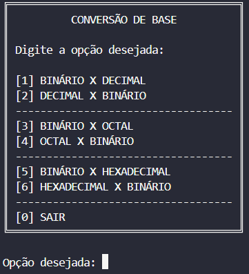
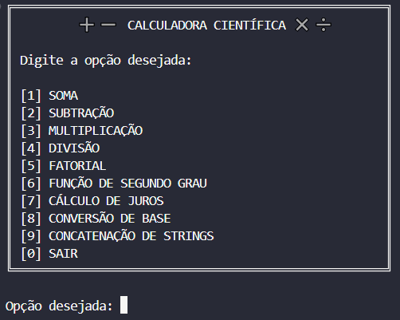
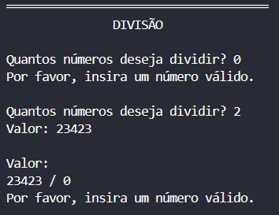
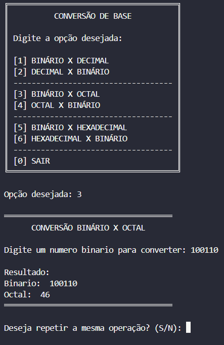
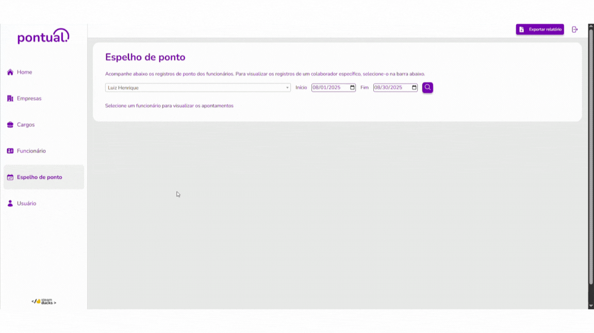
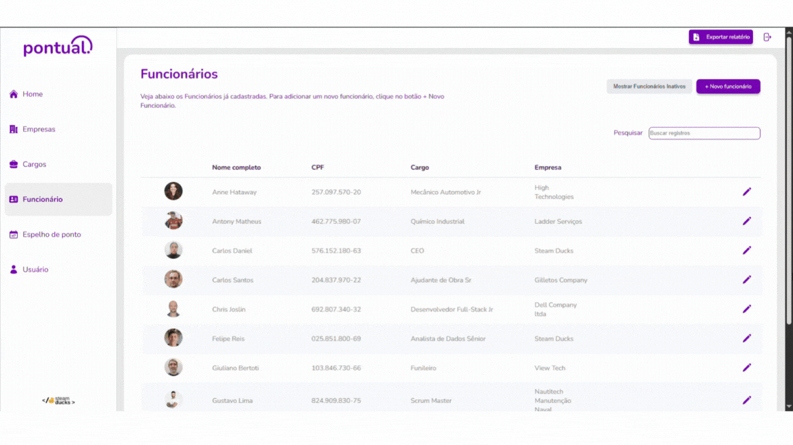
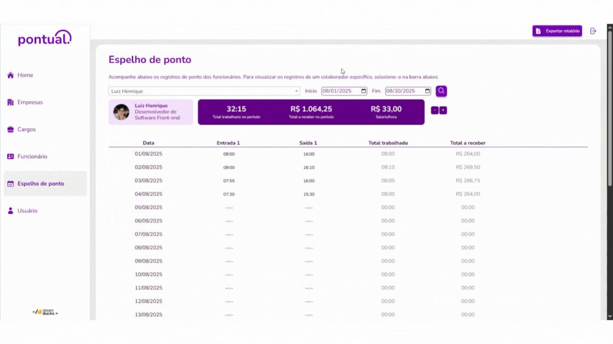

  
   
   
  

  Olá! Meu nome é <b>Luiz</b> e atualmente curso o <b>5º semestre de Banco de Dados</b> na Fatec de São José dos Campos. Trabalho como Business Analyst I na <b>Your ID INC</b>.
   

<!-- Links de Contato com Badges Estilizados -->
  

    
    
    
  

  

    
  

  

<!-- 1º Semestre -->

 <h1>1º Semestre • 1/2024</h1>

  <h3><a href="https://github.com/Steam-Ducks/scientific-calculator/tree/main" target="_blank">Calculadora Científica</a></h3>
  
<i>Aplicação em terminal desenvolvida para executar operações matemáticas, conversões numéricas e validações de entrada, evoluindo de VisualG para TypeScript ao longo das sprints.</i>

   
  
   
  

    
  

  
Detalhes do Projeto

  

    
  

  

    No primeiro semestre de 2024, desenvolvemos o projeto <b>Calculadora Científica</b>, uma aplicação em terminal criada para executar operações matemáticas, conversões entre bases numéricas e outros cálculos complementares. O projeto foi desenvolvido em contexto acadêmico, com foco no aprendizado prático de programação e organização de software, atendendo a um <b>cliente interno</b>.
  

  

    O desenvolvimento foi dividido em sprints, com as primeiras entregas sendo realizadas em <b>VisualG</b> e a evolução posterior para <b>TypeScript</b>. Essa transição foi importante para consolidar a lógica de programação e também para introduzir o time a práticas mais próximas do desenvolvimento real, como modularização, versionamento e integração entre funcionalidades.
  

  

    Entre as funcionalidades implementadas estavam operações aritméticas, divisão, fatorial, cálculo de juros, concatenação de strings e conversões entre diferentes bases numéricas. Além da construção funcional da calculadora, o projeto também exigiu cuidado com a experiência de uso no terminal, organização dos menus e tratamento de entradas inválidas.
  

  

    
  

   

  

    
  

   

  

    
🛠️ Implementação e integração de funcionalidades no menu principal

    

    

      Uma das minhas contribuições foi participar da organização do fluxo principal da calculadora, conectando operações ao menu e ajudando a estruturar a navegação do sistema em terminal. Esse tipo de contribuição foi importante para garantir que as funções desenvolvidas pela equipe pudessem ser acessadas de forma clara e organizada pelo usuário.
    

    

      O menu principal centralizava operações como soma, subtração, multiplicação, divisão, fatorial, função de segundo grau, cálculo de juros, conversões e concatenação de strings. Além disso, a aplicação também contava com submenus específicos, como o de conversão de base, o que ajudava a manter a experiência de uso mais intuitiva.
    

    
<b>Trecho do código:</b>

    <pre><code class="language-js">console.log("║ [1] SOMA                                           ║");
      console.log("║ [2] SUBTRAÇÃO                                      ║");
      console.log("║ [3] MULTIPLICAÇÃO                                  ║");
      console.log("║ [4] DIVISÃO                                        ║");
      console.log("║ [5] FATORIAL                                       ║");
      console.log("║ [6] FUNÇÃO DE SEGUNDO GRAU                         ║");
      console.log("║ [7] CÁLCULO DE JUROS                               ║");
      console.log("║ [8] CONVERSÃO DE BASE                              ║");
      console.log("║ [9] CONCATENAÇÃO DE STRINGS                        ║");

    switch (opcao) {
      case "4":
        do {
          divisao();
        } while (repetirOperacao());
        break;
      case "8":
        selecionarConversao();
        break;
    }</code></pre>

  

    
<b>Exemplo visual:</b>

    
  

  

   

  

    
🛠️ Validação de entrada e tratamento de erros na divisão

    

    

      Uma parte importante da minha atuação no projeto esteve relacionada ao tratamento de entradas inválidas, especialmente na operação de divisão. Em uma aplicação de terminal, onde o usuário interage apenas digitando valores, garantir a validação correta dos dados é essencial para evitar falhas e tornar o sistema mais seguro.
    

    

      Trabalhei em melhorias como a validação da quantidade mínima de números, verificação de entrada numérica válida, prevenção de divisão por zero e cuidado com a exibição do resultado. Essas correções ajudaram a tornar a operação mais robusta e melhoraram a experiência do usuário ao utilizar a calculadora.
    

    
<b>Trecho do código:</b>

    <pre><code class="language-js">do {
    num = prompt("Quantos números deseja dividir? ");
    validInput = /^\d+$/.test(num);
    quantidade = parseInt(num);

      if (!validInput || isNaN(quantidade) || quantidade &lt;= 1) {
        console.log("Por favor, insira um número válido.");
      }
    } while (!validInput || isNaN(quantidade) || quantidade &lt;= 1);

    if (divisor === 0) {
      console.log("Não é possível dividir por zero. Tente novamente.");
      return;
    }</code></pre>

  

    
<b>Exemplo visual:</b>

    
  

  

   

  

    
🛠️ Desenvolvimento de conversões numéricas

    

    

      Também contribuí no desenvolvimento de funcionalidades ligadas às conversões numéricas, como a conversão de binário para octal. Esse tipo de implementação exigiu atenção à lógica de programação, validação da entrada do usuário e transformação correta dos valores entre diferentes representações numéricas.
    

    

      Além da lógica principal da conversão, também trabalhei com a validação da entrada binária, evitando que valores inválidos fossem processados. Essa contribuição foi importante para ampliar o conjunto de funcionalidades da calculadora e reforçar meu aprendizado em estruturas condicionais, repetição e manipulação de dados.
    

    
<b>Trecho do código:</b>

    <pre><code class="language-js">for (let index = 0; index &lt; binario.length; index++) {
      let letraAtual = binario[index];

      if (letraAtual !== "1" && letraAtual !== "0") {
        valido = "Invalido";
      }
    }

    for (let index = binario.length - 1; index &gt;= 0; index--) {
      if (binario[index] === "1") {
        decimal += 2 ** potencia;
      }
      potencia++;
    }

    do {
      octal = Math.floor(decimal % 8);
      decimal /= 8;
      Resul += octal.toString();
    } while (decimal &gt; 1);</code></pre>

  

    
<b>Exemplo visual:</b>

    
  

  

   

  

    
  

  <h2> 💻 Hard Skills </h2>

  

    
🛠️ Lógica de Programação

    <ul>
      <li>Desenvolvi minha base em lógica de programação ao implementar funções matemáticas, menus e estruturas condicionais.</li>
      <li>Aprendi a organizar melhor entradas, processamento e saída de dados em uma aplicação de terminal.</li>
      <li>Esse aprendizado foi essencial para compreender como transformar regras de negócio em código funcional.</li>
    </ul>
  

  

    
🛠️ TypeScript Básico

    <ul>
      <li>Tive meus primeiros contatos com TypeScript durante a evolução do projeto.</li>
      <li>Aprendi noções de tipagem, organização modular e estruturação de funções em uma linguagem mais próxima do mercado.</li>
      <li>Isso me ajudou a entender melhor boas práticas de desenvolvimento e legibilidade do código.</li>
    </ul>
  

  

    
🛠️ Git e GitHub

    <ul>
      <li>Aprendi a utilizar versionamento de código para registrar e integrar minhas alterações no projeto.</li>
      <li>Pratiquei o uso de commits, merges e acompanhamento da evolução do repositório em equipe.</li>
      <li>Esse contato foi importante para entender fluxos de colaboração no desenvolvimento de software.</li>
    </ul>
  

  <h2> 🤝 Soft Skills </h2>

  

    
🌱 Trabalho em Equipe

    <ul>
      <li>Aprendi a colaborar com os integrantes do grupo durante a divisão e integração das funcionalidades.</li>
      <li>Essa convivência me ajudou a entender melhor a importância da comunicação e da responsabilidade compartilhada.</li>
      <li>O projeto mostrou que mesmo tarefas pequenas impactam diretamente no resultado coletivo.</li>
    </ul>
  

  

    
🌱 Adaptação ao Scrum

    <ul>
      <li>Tive contato com a organização do trabalho em sprints, backlog e entregas incrementais.</li>
      <li>Aprendi a acompanhar a evolução do projeto em etapas e a me adaptar a prioridades definidas pelo time.</li>
      <li>Isso me ajudou a desenvolver uma visão mais estruturada sobre gestão de desenvolvimento.</li>
    </ul>
  

  

    
🌱 Padronização e Disciplina no Desenvolvimento

    <ul>
      <li>Aprendi a importância de seguir padrões de organização, nomenclatura e versionamento.</li>
      <li>Esse cuidado contribuiu para deixar o código mais compreensível e facilitar a manutenção do projeto.</li>
      <li>Também foi uma experiência importante para criar disciplina nas minhas primeiras práticas de programação.</li>
    </ul>
  

---
<!-- 3º Semestre -->

 <h1>3º Semestre • 1/2025</h1>

  <h3><a href="https://github.com/Steam-Ducks/point-system" target="_blank">Pontual - Sistema de Ponto</a></h3>
  
<i>Aplicação web para monitorar horas trabalhadas de funcionários de empresas terceirizadas, desenvolvida para a empresa Altave.</i>

   
  
   
  

    
  

  
Detalhes do Projeto

 
  

    
  

  

    No terceiro semestre, desenvolvemos um sistema de ponto que batisamos de Pontual, uma aplicação web para monitorar horas trabalhadas de funcionários de empresas terceirizadas. Nosso cliente, a Altave, é uma empresa que atua com coleta de imagens e reconhecimento facial, começaram com balões meteorológicos e hoje trabalham com segurança, por exemplo, em plataformas petrolíferas.
  

  

    O caso que o cliente nos apresentou envolvia um estaleiro, onde empresas terceiras fazem manutenção em navios. As câmeras da Altave identificam os colaboradores e enviam essas informações para o sistema, que registra os pontos, calcula horas trabalhadas e gera o valor do salário individualmente.
  

  
  

    No projeto, desenvolvemos uma interface para cadastro de empresas e profissionais, filtros de dados, extração de relatórios e dashboards interativos. Um dos desafios foi lidar com funcionários em escalas noturnas e permitir a edição de pontos.
  

  

    
  

  ---
  

    
  
 
  🛠️ Estruturação do projeto em Vue.js
  

  

      Organizei a estrutura do projeto, defini padrões de código e criei layouts e componentes reutilizáveis para garantir consistência e manutenção eficiente.
  

    

  

    - Organizei as pastas, defini rotas e criei padrões de código para garantir consistência no projeto.
    - Estruturei os layouts principais e componentes reutilizáveis.
  

    Estruturei a arquitetura das pastas e defini rotas claras para facilitar a navegação e a manutenção do código. Além disso, estabeleci padrões de desenvolvimento para garantir consistência entre os módulos e maior legibilidade do código. Também desenvolvi os layouts principais e componentes reutilizáveis, promovendo uma interface coerente e otimizando o tempo de desenvolvimento em futuras implementações.
  
 
  
<b>Trecho do arquivo de rotas:</b>

    <pre><code class="language-js">
    import UserPage from '@/views/users/UserIndex.vue';
    import Test from '@/components/Test.vue';
    import LoginPage from '@/views/auth/AuthIndex.vue';
    import admintLayout from "@/layout/AdmintLayout.vue";
    import PositionPage from '@/views/position/PositionIndex.vue';
    const routes = [
      {
        path: '/',
        name: 'Login',
        component: LoginPage,
      },
      {
        path: '/home',
        name: 'Home',
        meta: { requiresAuth: true },
        component: admintLayout,
        children: [
          {
            path: '',
            component: HomePage
          }
        ]
      },
      {
        path: '/user',
        component: AdminLayout,
        meta: { requiresAuth: true },
        children: [
          {
            path: '',
            component: UserPage,
          },
        ],
      }
      ...
    ];
  </code></pre>
  

      
<b>Navegação entre as páginas:</b>

      
  

  

  

  ⚙️ Integração do frontend com o backend
  

    

    Implementei a integração com a API, configurando interceptadores para autenticação e tratamento de erros durante o consumo e manipulação de dados
  

    

      

        Implementei a comunicação entre o frontend e a API, garantindo o consumo eficiente dos endpoints responsáveis pela exibição e manipulação dos dados da aplicação. Configurei interceptadores de requisição          e resposta para gerenciar automaticamente tokens de autenticação, lidar com erros de forma centralizada e melhorar a segurança e a confiabilidade das operações. Essa abordagem tornou o fluxo de dados             mais robusto, padronizado e fácil de manter ao longo do desenvolvimento.
      

  
<b>Trecho do arquivo `TimeRecordService`:</b>

  <pre>

    <code class="language-js">
    import axios from 'axios';
    import UserService from './UserService';
    const API_URL = 'http://localhost:8080/api/timerecords';
    const formatToLocalDateTimeString = (dateInput) => {
      let date;
      if (dateInput instanceof Date) {
        date = dateInput;
      } else if (typeof dateInput === 'string') {
        if (/^\d{4}-\d{2}-\d{2}$/.test(dateInput)) {
          return `${dateInput}`;
        }
        date = new Date(dateInput);
      } else {
        console.warn("Tipo de data inválido recebido:", dateInput);
        return null;
      }
      if (!date || isNaN(date.getTime())) {
        console.warn("Não foi possível parsear a data:", dateInput);
        return null;
      }
    };
 </code></pre>
  

      
<b>Consumo de end point para listar marcações de ponto:</b>

    
  

  

  

  🖥️ Contribuições no backend
  

    

      Desenvolvimento de classes e services para estruturar a lógica da aplicação e integrei o projeto ao banco de dados online Supabase
    

      

    

      - Criação de classes e services.
      - Integração com banco online <b>Supabase</b>.
      Desenvolvimento classes e serviços responsáveis por organizar a lógica de negócio e facilitar a comunicação entre os diferentes módulos da aplicação. Estruturei os services de forma modular, promovendo           reutilização de código e separação de responsabilidades. Além disso, integrei o projeto ao banco de dados online **Supabase**, configurando a conexão e implementando operações de leitura, escrita e               atualização de dados de maneira segura e performática. Essa integração garantiu maior escalabilidade e eficiência no gerenciamento das informações.
    

    
<b>Trecho da classe `EmployeeController`:</b>

      <pre><code class="language-java">
      public class EmployeeController {
          @Autowired
          private final EmployeeService employeeService;
          private final SupabaseStorageService supabaseStorageService;
          public EmployeeController(EmployeeService employeeService, SupabaseStorageService supabaseStorageService) {
              this.employeeService = employeeService;
              this.supabaseStorageService = supabaseStorageService;
          }
          @PostMapping
          public ResponseEntity<?> createEmployee(@RequestBody EmployeeDto employeeDto) {
              try {
                  int employeeId = employeeService.createEmployee(employeeDto);
                  return ResponseEntity.status(HttpStatus.CREATED)
                          .body(Map.of("id", employeeId));
              } catch (IllegalArgumentException e) {
                  return ResponseEntity.status(HttpStatus.BAD_REQUEST)
                          .body(Map.of("message", e.getMessage()));
              } catch (ResponseStatusException e) {
                  return ResponseEntity.status(HttpStatus.NOT_FOUND)
                          .body(Map.of("message", e.getReason()));
              } catch (Exception e) {
                  return ResponseEntity.status(HttpStatus.INTERNAL_SERVER_ERROR)
                          .body(Map.of("message", "Erro ao criar um novo funcionário. Tente novamente."));
              }
          }
          @PostMapping("/uploadPhoto")
          public ResponseEntity<?> uploadEmployeePhoto(@RequestParam("file") MultipartFile file) {
              try {
                  String photoUrl = supabaseStorageService.uploadEmployeePhoto(file);
                  return ResponseEntity.ok(Map.of("photoUrl", photoUrl));
              } catch (Exception e) {
                  return ResponseEntity.status(HttpStatus.INTERNAL_SERVER_ERROR)
                          .body(Map.of("message", "Erro no upload de foto"));
              }
          }
      }
      
    </code></pre>
          
    
<b>Trecho do `application.properties`:</b>

      <pre><code class="language-properties">
      spring.jpa.database=postgresql
      spring.jpa.database-platform=org.hibernate.dialect.PostgreSQLDialect
      spring.jpa.hibernate.ddl-auto=none
      spring.jpa.show-sql=true
      supabase.auth.token=Bearer eyJhbGciOiJIUzI1NiIsInR5cCI6IkpXVCJ9...
      spring.datasource.url=jdbc:postgresql://aws-0-sa-east-1.pooler.supa...
      spring.datasource.username=postgres...
      spring.datasource.password=********
      spring.datasource.driver-class-name=org.postgresql.Driver
    </code></pre>
      

        
<b>Consumo de end point para listar marcações de ponto:</b>

        
      

    

          🚀 Criação da folha de ponto
    

    

      Criação da lógica por calculo e impressão dos pontos em telas
    

      

    

      - Criação da lógica por calculo e impressão dos pontos em telas
    

    
<b>Trecho de TimeReconrdIndex.vue</b>

        Desenvolvi toda a lógica responsável pelo cálculo e exibição dos pontos na interface. Implementei funções para processar os dados de entrada, realizar os cálculos necessários e gerar resultados precisos em       tempo real. Além disso, estruturei o código para garantir que os pontos fossem renderizados corretamente nas telas, mantendo coerência visual e desempenho otimizado. Essa implementação permitiu uma               experiência dinâmica e interativa para o usuário, com atualização automática das informações conforme as ações realizadas
      

    <b>Trecho de TimeReconrdIndex.vue</b>

      <pre><code class="language-js">
      computed: {
      // Lista os funcionarios no select
      employeeslist() {
        return this.employees.map((employee) => ({
          id: employee.id,
          name: employee.name,
        }));
      },
      hasAnyEntrada2() {
          return this.processedTimeRecords.some(record => record.entrada2);
      },
      hasAnyEntrada3() {
          return this.processedTimeRecords.some(record => record.entrada3);
      },
      totalWorkedPeriod() {
      if (!this.processedTimeRecords || this.processedTimeRecords.length === 0) {
        return '00:00';
      }
      const totalMinutes = this.processedTimeRecords.reduce((sum, record) => {
        const [hours, minutes] = record.totalTrabalhadoDia.split(':').map(Number);
        return sum + (hours * 60) + minutes;
      }, 0);
      const hours = Math.floor(totalMinutes / 60);
      const minutes = totalMinutes % 60;
      return `${String(hours).padStart(2, '0')}:${String(minutes).padStart(2, '0')}`;
      },
    </code></pre>
    

        
<b>Exemplo de inclusão de ponto:</b>

      
    

     
  

  

    
  

  <h2> 💻 Hard Skills </h2>
  

    
🛠️ Vue.js e arquitetura de frontend

    <ul>
      <li>Aprendi a organizar rotas, layouts e componentes reutilizáveis em um projeto de médio porte.</li>
      <li>Esse aprendizado veio da necessidade de manter a aplicação escalável, já que várias telas compartilhavam elementos comuns.</li>
      <li>Isso ajudou o time a padronizar o código e reduzir retrabalho no desenvolvimento do frontend.</li>
    </ul>
  

  

    
🛠️ Integração de frontend e backend

    <ul>
      <li>Desenvolvi a habilidade de consumir APIs reais e lidar com autenticação, erros e tratamento de dados.</li>
      <li>Essa experiência veio principalmente da criação dos serviços de comunicação com a API no Vue.js.</li>
      <li>No projeto, isso foi essencial para garantir que as telas exibissem informações atualizadas e funcionais para o cliente.</li>
    </ul>
  

  

    
🛠️ Java Spring Boot e integração com banco de dados

    <ul>
      <li>Ganhei prática com a criação de controllers, services e integração com o Supabase.</li>
      <li>Aprendi a lidar com persistência de dados em PostgreSQL e tratamento de exceções no backend.</li>
      <li>Esse aprendizado foi crucial para estruturar o backend de forma confiável e segura, suportando as regras de negócio.</li>
    </ul>
  

  

    
🛠️ SQL e consultas otimizadas

    <ul>
      <li>Melhorei minha escrita de queries no PostgreSQL, incluindo consultas com filtros de data e agregações.</li>
      <li>Esse conhecimento veio da necessidade de gerar relatórios de horas trabalhadas e cálculos de folha de ponto.</li>
      <li>Isso permitiu que o sistema apresentasse informações corretas e em tempo hábil para o cliente.</li>
    </ul>
  

  <h2> 🤝 Soft Skills </h2>
  

    
🌱 Colaboração em equipe

    <ul>
      <li>Auxiliei meus colegas de grupo no desenvolvimento de suas partes do projeto, oferecendo suporte técnico e sugestões.</li>
      <li>Essa colaboração ajudou o time a manter o ritmo de trabalho e reduzir retrabalho.</li>
      <li>Contribuiu para um ambiente mais coeso e eficiente durante todo o desenvolvimento.</li>
    </ul>
  

  

    
🌱 Brainstorm e planejamento

    <ul>
      <li>Participei de sessões de brainstorming para definir quais telas e funcionalidades o sistema precisaria ter.</li>
      <li>Ajudei a identificar soluções para fluxos complexos, como marcações de ponto que atravessam a meia-noite.</li>
      <li>Essas decisões antecipadas facilitaram o desenvolvimento e reduziram possíveis retrabalhos.</li>
    </ul>
  

  

    
🌱 Resolução de problemas complexos

    <ul>
      <li>Contribuí para encontrar soluções técnicas para situações desafiadoras, como horários noturnos e cálculos de ponto específicos.</li>
      <li>Isso exigiu análise lógica e criatividade, garantindo que a aplicação funcionasse corretamente em todos os cenários.</li>
      <li>Minimizou erros e melhorou a confiabilidade do sistema.</li>
    </ul>
  

  

    
🌱 Organização e revisão de tarefas

    <ul>
      <li>Auxiliei na revisão e organização do código de colegas, mantendo padrões consistentes.</li>
      <li>Isso ajudou a evitar conflitos e problemas de integração entre diferentes partes do sistema.</li>
      <li>Contribuiu para a qualidade geral do projeto e facilitou o desenvolvimento colaborativo.</li>
    </ul>
  

